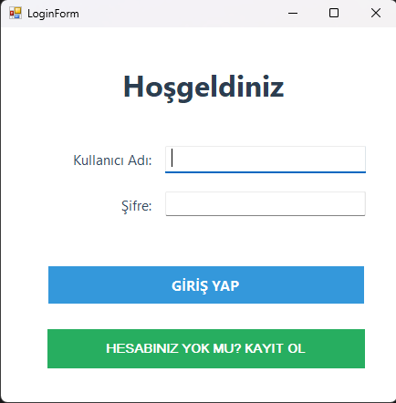
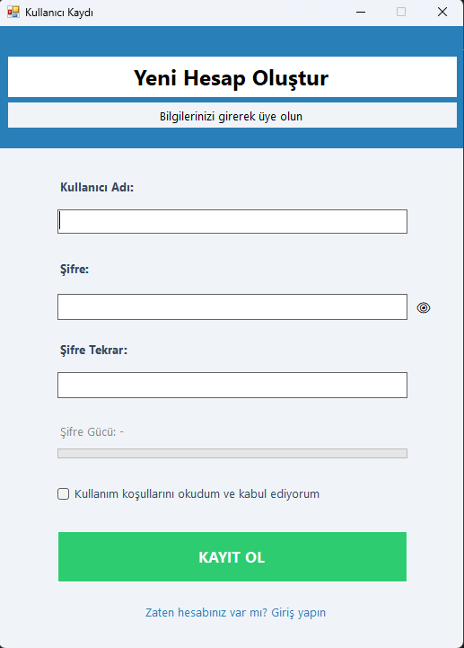
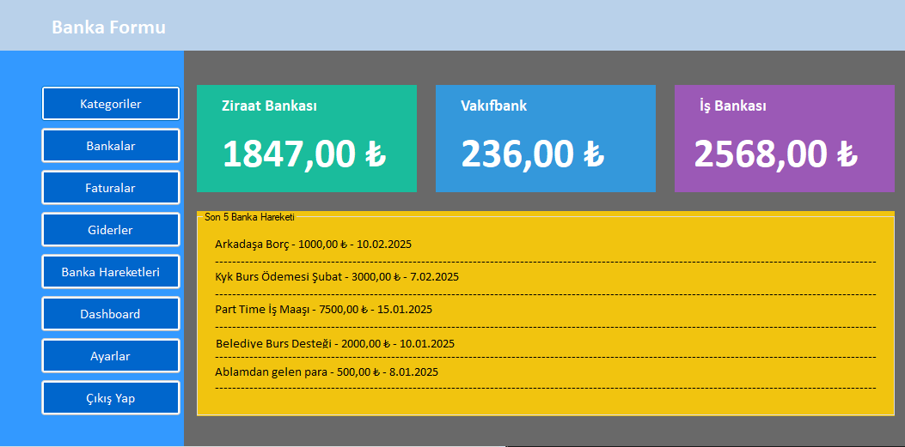
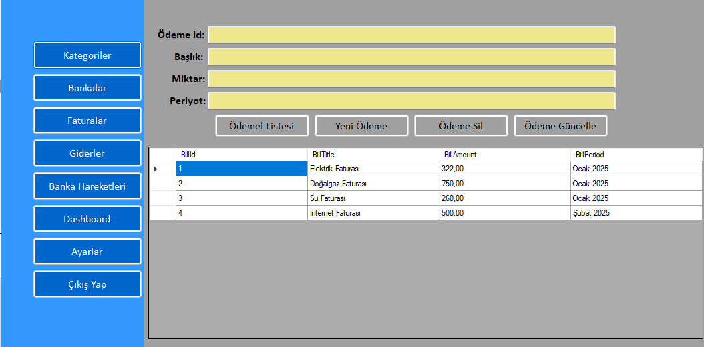
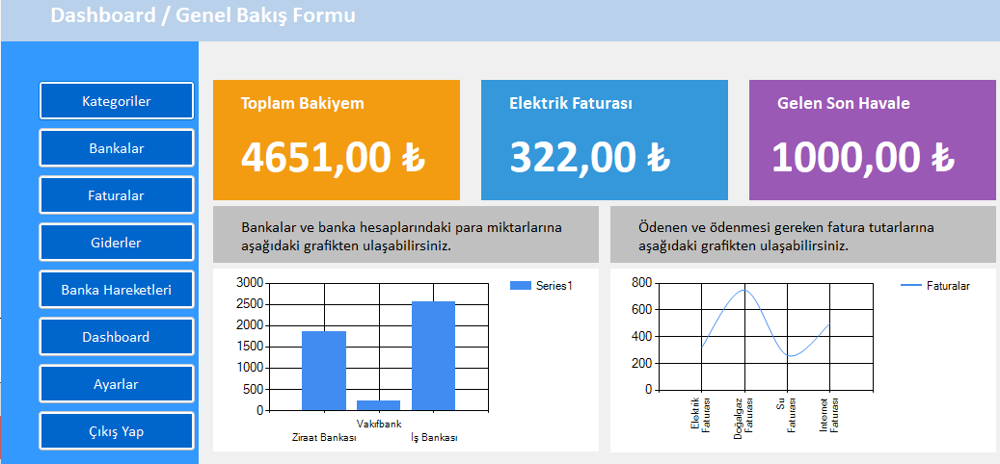

# 💳 Financial CRM (C# WinForms + Entity Framework 6)

**Financial CRM** is a desktop application developed with **C# WinForms** and **Entity Framework 6**, designed to track financial data in a simple and structured way.  
The application allows users to manage **bank accounts**, **bank transactions**, **bills**, and a **dashboard with charts**.

This project was built mainly for practicing **desktop application development**, **database operations**, and **LINQ/Entity Framework** usage.

---

## 🚀 Features

- ✅ User **Login** and **Register** system  
- ✅ **Dashboard**
  - Total balance calculation
  - Latest bank transaction amount
  - Charts for bank balances and bills
- ✅ **Banks Module**
  - List bank accounts and balances
  - Display recent bank transactions
- ✅ **Billing Module**
  - View bill types and amounts
- ✅ SQL Server + Entity Framework 6 (EDMX) database integration  

---

## 🧠 Key Technical Highlights

- **Entity Framework 6 (Database First / EDMX)**  
- **LINQ** for:
  - Total balance calculation
  - Filtering and listing bank transactions  
- **WinForms Chart** component for data visualization  
- Multi-form structure with navigation between:
  - Dashboard
  - Banks
  - Billing
  - Login/Register  

---

## 🛠️ Technologies Used

- **C# (.NET Framework 4.7.2)**
- **Windows Forms**
- **Entity Framework 6.5.1**
- **SQL Server (SQLEXPRESS)**
- **LINQ**
- **System.Windows.Forms.DataVisualization (Chart)**

---

## 🗄️ Database

This project uses **SQL Server** and expects a database named:

**FinancialCrmDb**

Connection settings can be found in:

`FinancialCrm/App.config`

> If your SQL Server instance name is different, update the `connectionString` inside App.config.

---

## ▶️ How to Run

1. Clone or download the repository  
2. Open the solution in **Visual Studio**  
3. Make sure SQL Server service is running (`SQLEXPRESS`)  
4. Create or restore the `FinancialCrmDb` database  
5. Run the project  

---

## 🖼️ Screenshots

### 🔐 Login Screen

### 📝 Register Screen

### 🧭 Main Menu

### 🏦 Banks Module

### 💡 Billing Module

### 📊 Dashboard / Overview

---

## 📌 Project Purpose

This project was developed to gain hands-on experience in:

- Desktop application development with WinForms  
- CRUD operations with Entity Framework  
- SQL Server database connection and management  
- Reporting and calculations using LINQ  
- Data visualization with charts  

---

## 👤 Author

**Mehmetcan Yıldırım**  
Computer Engineering Student  

---

## ⭐ Note

This project was developed for educational purposes.  
Feedback and suggestions are welcome.
